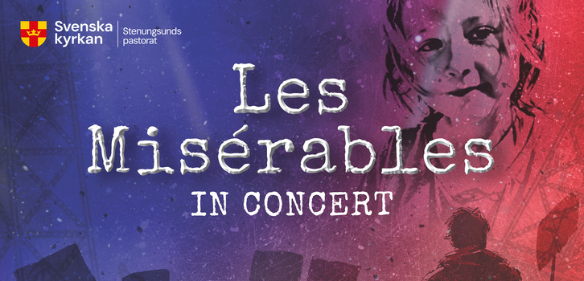

# Concert: Les Misérables (Jean Valjean)

This weekend, I will be taking on the role of Jean Valjean in **Les Misérables in Concert**. 

This production is a massive collaborative project bringing together all the choirs of Stenungsund's parish, a dedicated project choir, soloists, and instrumentalists. 

At its core, this concert version focuses on the profound human journey at the center of the story:

> Follow Jean Valjean's lifelong struggle for redemption. After years as a hardened convict, an unexpected act of mercy transforms him from an embittered outcast into a man dedicated to compassion and helping those he meets along his path. Set against the backdrop of 19th-century France, *Les Misérables* is a powerful story about the clash between rigid justice and profound empathy, reminding us of the enduring power of the human spirit and what it means to bear one another's burdens.

### Event Details
* **Date:** Sunday, March 22, 2026
* **Performances:** 14:30 and 18:00
* **Location:** Ödsmåls kyrka (Ödsmåls kyrkväg 1, Ödsmål)
* **Tickets:** Free entry, but limited seating (booking required).